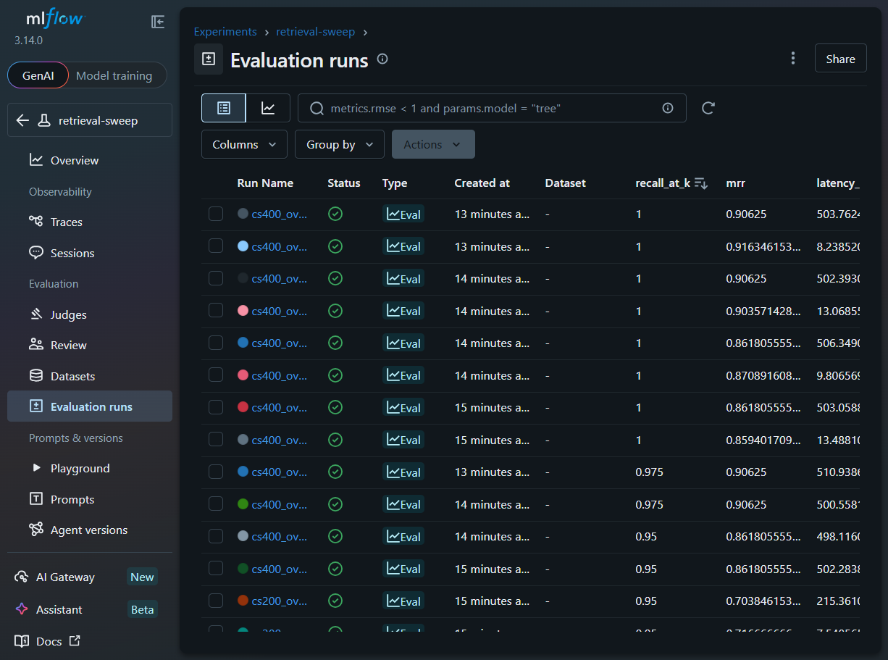

# KKBox Retention Intelligence Assistant

A retention assistant for a music-streaming service that will answer policy questions with hybrid
RAG, answer subscriber-risk questions by calling a deployed KKBox churn model, and — for combined
questions — condition retrieval on the model's SHAP drivers, so the retention playbook it returns
matches *why that specific subscriber is at risk*.

This is not "another RAG chatbot." The differentiator is a retrieval system conditioned on a live
churn model's SHAP explanations, not document search alone. The full rationale for that claim, the
architecture, and the phased build plan are in `retention_intelligence_assistant_build_plan.md`.

## Status

Retrieval is implemented and evaluated: ingestion, chunking, dense (FAISS) + sparse (BM25)
retrieval, Reciprocal Rank Fusion, CrossEncoder reranking, a hand-labeled retrieval eval, and an
MLflow sweep over chunk size / overlap / embedding model / top-k / rerank. Results below. Churn
integration and the generation layer haven't landed yet — see `DECISIONS.md` for the architectural
choices already locked in for both.

## Planned architecture

```
                          User query
                              │
                        FastAPI Backend
                              │
                     Intent Classification
                     (policy | customer | both)
              ┌───────────────┼───────────────┐
              │               │               │
          POLICY          CUSTOMER          BOTH
              │               │               │
              │        get_churn_risk(id)  1. get_churn_risk(id)
              │        → risk + SHAP          → risk + top SHAP drivers
              │               │            2. drivers_to_query(drivers)
              │               │               → churn-conditioned query
              │               │            3. hybrid RAG on THAT query
        Hybrid RAG            │               │
        (BM25+Dense+RRF)      │           Hybrid RAG (conditioned)
              │               │               │
        CrossEncoder          │           CrossEncoder
         rerank               │            rerank
              │               │               │
              └───────────────┼───────────────┘
                              │
                       Context assembly
              (retrieved chunks + SHAP drivers + segment
               context from tenure_days / n_prior_cycles)
                              │
                        LLM Generator
                   (grounded, cited answer)
                              │
                    Groundedness check
                              │
                     Confidence score ──low──► "Insufficient evidence"
                              │
                          Response
                              │
                       SQLite logging
```

## Planned tech stack

| Layer | Tool |
|---|---|
| API | FastAPI + uvicorn |
| PDF ingestion | PyMuPDF (`fitz`) |
| Tabular ingestion | pandas |
| Embeddings | sentence-transformers (`bge-small-en-v1.5`) |
| Dense index | FAISS |
| Sparse | `rank_bm25` (BM25Okapi) |
| Fusion | Reciprocal Rank Fusion (hand-written) |
| Reranking | CrossEncoder (`ms-marco-MiniLM-L-6-v2`) |
| LLM | Groq (Llama 3.3 70B) primary, Ollama (local) fallback |
| Churn tool | A deployed KKBox churn model + SHAP (separate project, reused here) |
| Experiment tracking | MLflow |
| Logging | SQLite |

Deliberately not used: LangChain/LlamaIndex, agent frameworks, MCP, LangGraph, long-term memory,
Kubernetes, Prometheus/Grafana. See `DECISIONS.md` for why.

## Retrieval evaluation (20 hand-labeled queries, k=5)

| System | Recall@5 | MRR | Latency (ms) |
|---|---|---|---|
| BM25 only | 0.900 | 0.842 | 0.2 |
| Dense only | 0.925 | 0.925 | 17.3 |
| Hybrid (BM25+Dense+RRF) | 0.925 | 0.900 | 13.3 |
| Hybrid + CrossEncoder rerank | 0.900 | 0.900 | 502.2 |

At this corpus's scale, hybrid+RRF alone already saturates recall, so the reranker's ~500ms doesn't
pay for itself here — see `DECISIONS.md` for why it's still kept in the pipeline.

## MLflow retrieval sweep (72 runs: chunk_size × overlap × embedding × top_k × rerank)



Confirms chunk_size=400 / overlap=50 as the right default. Full reasoning on the embedding-model and
rerank trade-offs in `DECISIONS.md`.

## Repository layout

```
├── README.md
├── DECISIONS.md
├── retention_intelligence_assistant_build_plan.md
├── requirements.txt
├── .env.example
├── data/{raw,processed,eval}/
├── src/
│   ├── ingest/         (loaders, chunker)
│   ├── retrieval/      (embed, dense, sparse, fusion, rerank)
│   ├── churn/          (churn model API, driver-to-query conditioning)
│   ├── generation/     (router, generator, groundedness, confidence)
│   ├── logging_db.py
│   └── app.py
├── eval/               (retrieval eval, faithfulness eval, metrics notebook)
├── experiments/        (MLflow sweeps)
└── scripts/            (build_index, demo_queries)
```

## Setup

```bash
python -m venv .venv && .venv\Scripts\activate
pip install -r requirements.txt
cp .env.example .env        # fill in GROQ_API_KEY, or set LLM_BACKEND=ollama
```

```bash
python scripts/generate_corpus.py     # synthetic corpus -> data/raw/corpus/
python scripts/build_index.py         # ingest -> chunk -> embed -> dense + sparse indices
python eval/retrieval_eval.py         # ablation table -> data/eval/ablation_table.md
python experiments/mlflow_sweep.py    # retrieval config sweep -> logged to mlflow.db
```

Churn integration and generation aren't built yet, so `src/app.py` and the demo queries aren't
runnable — that lands over the following days per the build plan.
